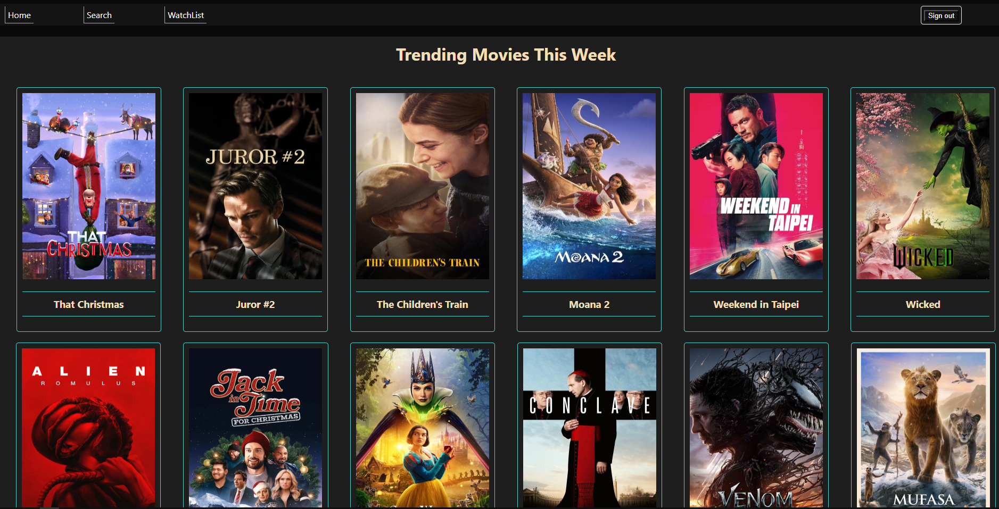
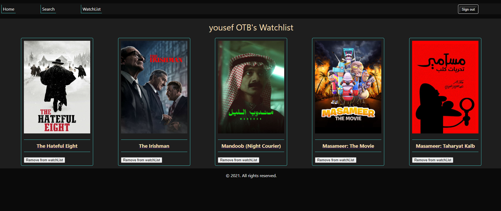

# movie App

**The Movie App** is a React-based movie discovery and management application.

using the TMDB API, the app allows users to browse detailed information about movies, add them to a personalized watchlist, and remove them as needed. The app leverages the TMDB API for real-time movie data and features user authentication for a tailored experience.

---

## Pages

-   **Home Page**: show trending movies this week
-   **Search**: search for a specefic movie
-   **Watch List**: allow authenticated users to save their movies to the watch list
-   **Movie Details**: show more information and details on any movie
-   **Login / Register**: allow users to login to their accounts using Email/Password Or by their Google account

---

## What I Used

-   **React.js**
-   **Firebase authentication**
-   **TMDB API**
-   **CSS Styling**

---

## Screenshots

### Home Page



---

### Search Page


---

### WatchList Page



---

### Movie Details Page


---

### Login Page


---

## Installation

1. Clone the repository:

    ```bash
    git clone https://github.com/OTB-01/405-project.git
    cd 405-project
    ```

2. Install dependencies:

    ```bash
    npm install
    ```

3. Start the development server:

    ```bash
    npm start
    ```

---
